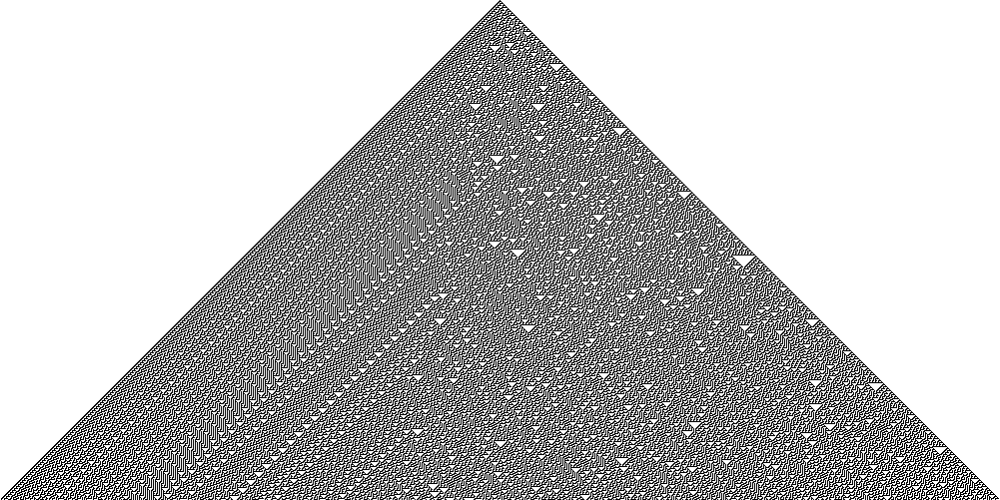
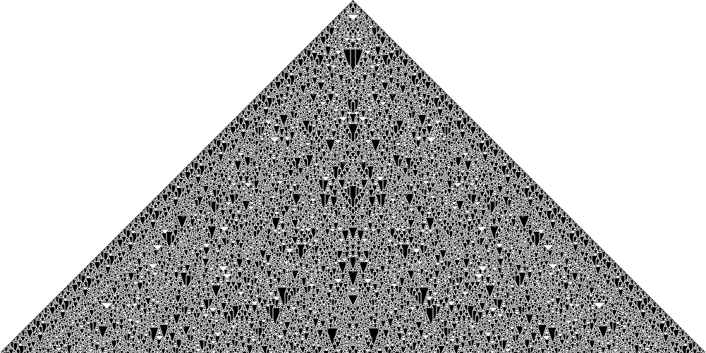

# cellular_automata
C++ implementations based on Wolfram's *"A New Kind of Science"*.

## Dependencies
- OpenCV

## Build
```
mkdir build && cd build
cmake -DCMAKE_BUILD_TYPE=Release ..
make cell_aut
./cell_aut 
```

## Examples
### Rule 30 (binary)


### Rule 2040 (three colour totalistic)
